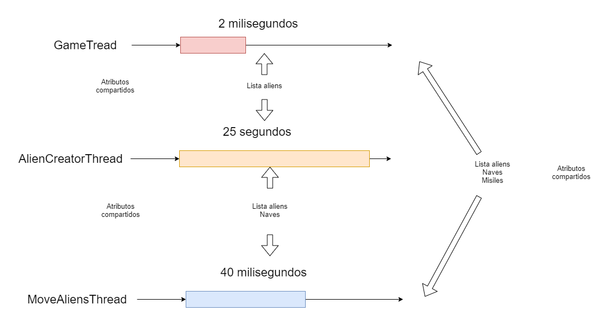

# SOPES2-PRACTICA2

## Problema 3 : Video Juego Space Invaders

### Arquitectura de la solución

Se tiene la siguiente estructura de archivos

```
├── /src/
│   ├── /Algoritmo3/
|   |   ├── /GUI/
|   |   |   ├── Board.java
|   |   |   ├── SpaceInvaders.java
|   |   ├── Alien.java
|   |   ├── GameObject.java
|   |   ├── Missile.java
|   |   ├── SpaceShip.java
```

Cada una de estas clases tiene su relación correspondiente. Que se describen acontinuación.

### SpaceConstants.java

Clase que contiene todas las constantes del programa.

```java
public class SpaceConstants {
  public static final int GAME_WIDTH = 800; // Ancho de la pantalla
  public static final int GAME_HEIGHT = 652; // Alto de la pantalla
  public static final int SHIP_WIDTH = 15; // Ancho de una nave
  public static final int SHIP_HEIGHT = 15; // Alto de una nave
  public static final int ALIEN_WIDTH = 19; // Ancho de un alien
  public static final int ALIEN_HEIGHT = 14; // Alto de un alien
  public static final int MISSILE_WIDTH = 4; // Ancho de un misil
  public static final int MISSILE_HEIGHT = 8; // Algo de un misil
  public static final int AMOUNT_OF_NEW_ALIENS = 4; // Cantidad de nuevos aliens
  public static final int GAME_SPEED = 2; // Velocidad del juego
  public static final int ALIEN_CREATION_SPEED = 25000; // Velocidad de creacion de aliens
  public static final int ALIENS_MOVE_SPEED = 45; // Velocidad de los aliens
}
```

### GambeObject.java

Clase abstracta que hereda sus atributos para poder dibujar cada uno de los elementos de la pantalla.

```java
public abstract class GameObject {

  // atributos de posicionamiento
  protected int xPos, yPos;
  // atributos de ancho y altura
  protected int with, height;
  // si es visible en pantalla
  protected boolean isVisible;

  protected GameObject(int xPos, int yPos, int with, int height) {
    this.xPos = xPos;
    this.yPos = yPos;
    this.with = with;
    this.height = height;
    this.isVisible = true;
  }

  public Rectangle getBounds() {
    return new Rectangle(this.xPos, this.yPos, this.with, this.height);
  }

  public abstract void move();
}
```

### SpaceShip.java

Clase que hereda de GameObject.java, esta clase es para controlar las naves de pantalla.

```java
public class SpaceShip extends GameObject
```

Para mover a la nave se utiliza el metodo move, el movimiento de las naves es solamente horizontal. Unicamente se modifica su variable xPos.

```java
@Override
public void move() {
  this.xPos += this.xDirection;
}
```

Para mover la nave se utiliza el teclado con las siguientes teclas. Para la primera nave: "A" - Izquierda , "S" - Disparar, "D" - Derecha; para la segunda nave: "J" - Izquierda, "K" - Disparar , "L" - Derecha. Cuando se crea una instancia de una nave se envia el codigo de las teclas correspondientes para el movimiento de cada nave.

```java
public void keyPressed(KeyEvent e) {
  int key = e.getKeyCode();
  if (key == this.leftKey) {
    this.xDirection = -1;
  } else if (key == this.rightKey) {
    this.xDirection = 1;
  } else if (key == this.fireKey) {
    fire();
  }
}

public void keyReleased(KeyEvent e) {
  int key = e.getKeyCode();
  if (key == this.leftKey) {
    this.xDirection = 0;
  } else if (key == this.rightKey) {
    this.xDirection = 0;
  }
}
```

Las naves estaran visibles en pantalla mientras aun tengan 3 vidas.

```java
public void reduceLife() {
  if (this.isVisible) {
    this.lifePoints--;
    this.isVisible = lifePoints > 0;
  }
}
```

### Alien.java

Clase que hereda de GameObject.java, esta clase es para controlar los aliens que van llegando cada 25 segundos en pantalla.

```java
public class Alien extends GameObject
```

Para mover a los aliens se utiliza el metodo move, el movimiento de los aliens es solamente vertical. Unicamente se modifica su variable yPos.

```java
@Override
public void move() {
  this.yPos++;
}
```

Los aliens estaran visibles en pantalla mientras aun tengan 2 vidas.

```java
public void reduceLife() {
  if (this.isVisible) {
    this.lifePoints--;
    this.isVisible = lifePoints > 0;
  }
}
```

### Missile.java

Clase que hereda de GameObject.java, esta clase es para controlar los missiles que son disparados por las naves.

```java
public class Missile extends GameObject
```

Para mover a los misiles se utiliza el metodo move, el movimiento de los misiles es solamente vertical. Unicamente se modifica su variable yPos.

```java
@Override
public void move() {
  this.yPos--;
}
```

### SpaceInvaders.java

La clase SpaceInvaders hereda de JFrame, esta clase es la pantalla de inicio del juego.

```java
public class SpaceInvaders extends JFrame {
```

esta clase contiene una lista de misiles, las 2 naves a mostrar en pantalla, y el tablero del juego.

```java
private final ArrayList<Missile> missiles;
private final SpaceShip ship1;
private final SpaceShip ship2;
private final Board board;
```

En el constructor de esta clase se crean las naves, las cuales son enviadas en el constructor del tablero.

```java
public SpaceInvaders() {
  super("Space Invaders");
  int maxHeight = SpaceConstants.GAME_HEIGHT - SpaceConstants.SHIP_HEIGHT - 62;
  int maxWidth = SpaceConstants.GAME_WIDTH - 16;
  this.missiles = new ArrayList<>();
  this.ship1 = new SpaceShip(
          maxWidth / 4, maxHeight, KeyEvent.VK_A,
          KeyEvent.VK_S, KeyEvent.VK_D, this.missiles
  );
  this.ship2 = new SpaceShip(
          3 * maxWidth / 4, maxHeight, KeyEvent.VK_J,
          KeyEvent.VK_K, KeyEvent.VK_L, this.missiles
  );
  this.board = new Board(this.ship1, this.ship2, this.missiles);
  initialSetup();
}
```

El siguiente metodo es para iniciar los atributos de la pantalla del juego, tanto su localizacion, su ancho y alto; sus botones de inicio y de parar; Y se envia los eventos de teclado de los movimientos de las naves.

```java
private void initialSetup() {
  setResizable(false);
  setSize(SpaceConstants.GAME_WIDTH, SpaceConstants.GAME_HEIGHT);
  setLocationRelativeTo(null);    
  add(this.board);
  JMenuBar menubar = new JMenuBar();
  JMenu menuStart = new JMenu("Start");
  JMenu menuStop = new JMenu("Stop");
  menuStop.setVisible(false);
  menuStart.addMouseListener(new java.awt.event.MouseAdapter() {
    @Override
    public void mouseClicked(java.awt.event.MouseEvent evt) {
      menuStop.setVisible(true);
      board.start();
      menuStart.setVisible(false);
      
    }
  });    
  menuStop.addMouseListener(new java.awt.event.MouseAdapter() {
    @Override
    public void mouseClicked(java.awt.event.MouseEvent evt) {
      menuStart.setVisible(true);
      board.stop();
      menuStop.setVisible(false);
    }
  });
  menubar.add(menuStart);
  menubar.add(menuStop);
  setJMenuBar(menubar);
  addKeyListener(new KeyController());
}
```

La siguiente clase controla los movimientos de las naves.

```java
private class KeyController extends KeyAdapter {

  @Override
  public void keyPressed(KeyEvent e) {
    ship1.keyPressed(e);
    ship2.keyPressed(e);
  }

  @Override
  public void keyReleased(KeyEvent e) {
    ship1.keyReleased(e);
    ship2.keyReleased(e);
  }

}
```

### Board.java

Esta clase pinta el tableo del juego

```java
public class Board extends JPanel 
```

Contiene las siguientes variables:

```java
private ExecutorService executorService; // Piscina de los hilos
private final ReentrantReadWriteLock padlock; // candado para bloquear la lista de los aliens
private final ArrayList<Missile> missiles; // lista de misiles a pintar en pantalla
private final ArrayList<Alien> aliens; // lista de aliens a pintar en pantalla
private final SpaceShip ship1; // nave numero 1
private final SpaceShip ship2; // nave numero 2
private boolean isPlaying; // bandera para saber si se inicio el juego
private int alienCounter; // contador de aliens a mostrar en pantalla
```

El metodo siguiente crea un nuevo alien, y lo inserta a la lista. Aqui se uso el candado para bloquear la lista de los aliens ya que otros hilos pueden acceder a ella. Cada 25 segundos se crea la cantidad de aliens especificada en la constante **AMOUNT_OF_NEW_ALIENS**.

```java
private void createAlien() {
  this.padlock.writeLock().lock(); // bloqueo
  try {
    this.alienCounter += SpaceConstants.AMOUNT_OF_NEW_ALIENS;
    Random randX = new Random();
    Random randY = new Random();
    Rectangle r = getBounds();
    int xLimit = (int) r.getMaxX() - SpaceConstants.ALIEN_WIDTH;
    int yLimit = (int) r.getMaxY();
    int xPos, yPos;
    for (int i = 0; i < this.alienCounter; i++) {
      xPos = randX.nextInt(xLimit);
      yPos = randY.nextInt(yLimit / 4);
      aliens.add(new Alien(xPos, yPos));
    }
  } finally {
    this.padlock.writeLock().unlock(); // desbloqueo
  }
}
```

El metodo siguiente mueve los misiles en pantalla y verifica si hubo alguna colision con un alien. Aqui se usa tambien el candado para bloquear la lista de aliens, ya que esta se utiliza para la verificacion de colisiones.

```java
private void moveMissiles() {
  this.padlock.readLock().lock(); // bloqueo
  try {
    Rectangle r = getBounds();
    int minY = (int) r.getMinY();
    missiles.forEach((missile) -> {
      missile.move(); // movimiento de misiles
      if (missile.getyPos() + SpaceConstants.MISSILE_HEIGHT <= minY) {
        missile.setVisible(false);
      }
      Rectangle boundsMissile = missile.getBounds();
      aliens.forEach((alien) -> {
        Rectangle boundsAlien = alien.getBounds();
        // colision entre alien y misil
        if (boundsMissile.intersects(boundsAlien)) {
          missile.setVisible(false);
          alien.reduceLife();
        }
      });
    });
    // remover los misiles que fueron colisionados o salieron del tablero
    missiles.removeIf((missile) -> !missile.isVisible());
  } finally {
    this.padlock.readLock().unlock(); // desbloqueo
  }
}
```

Movimiento de los aliens, en este metodo se bloquea en modo de lectura la lista de aliens, ya que se obtiene y se van moviendo una por una.

```java
private void moveAliens() {
  this.padlock.readLock().lock();
  try {
    Rectangle r = getBounds();
    int yLimit = (int) r.getMaxY();
    aliens.forEach((alien) -> {
      alien.move(); // movimiento de alien
      if (alien.getyPos() > yLimit) {
        alien.setVisible(false);
        // reducir vida de las naves si llegaran
        // hasta la parte inferior del tablero
        ship1.reduceLife();
        ship2.reduceLife();
      } else {
        Rectangle bounds = alien.getBounds();
        Rectangle boundsShip = ship1.getBounds();
        // colision entre nave 1 y un alien
        if (boundsShip.intersects(bounds)) {
          ship1.reduceLife();
          alien.setVisible(false);
        } else {
          boundsShip = ship2.getBounds();
          // colision entre nave 2 y un alien
          if (boundsShip.intersects(bounds)) {
            ship2.reduceLife();
            alien.setVisible(false);
          }
        }
      }
    });
    // remover los aliens que salieron del tablero o colisionaron
    // alguna nave.
    aliens.removeIf((alien) -> !alien.isVisible());
  } finally {
    this.padlock.readLock().unlock();
  }
}
```

El siguiente metodo realiza el pintado del movimiento de las naves.

```java
private void moveShips() {
  Rectangle r = getBounds();
  int minX = (int) r.getMinX();
  int maxX = (int) r.getMaxX();
  if (ship1.isVisible() && ship2.isVisible()) {
    // Si las dos naves estan presentes en el tablero
    // Se mandan a los limites de las naves
    // Para la nave 1 el minimo es el del tablero
    // y su maximo hasta donde se puede mover, es hasta
    // la posicion de x de la nave 2
    moveShip(ship1, minX, ship2.getxPos());
    // Para la nave 2 su limite inferior es la posicion en x de
    // la nave 1, y su limite superior es el del tablero
    moveShip(ship2, ship1.getxPos() + SpaceConstants.SHIP_WIDTH, maxX);
  } 
  // Si alguna de las naves no esta presente, sus limites
  // son los del tablero
  else if (ship1.isVisible()) {
    moveShip(ship1, minX, maxX);
  } else if (ship2.isVisible()) {
    moveShip(ship2, minX, maxX);
  } 
  // Si ambas no estan presentes el juego termino
  else {
    gameOver();
  }
}

// El movimiento de las naves es el mismo, solo cambia los limites
// inferiores y superiores.
private void moveShip(SpaceShip ship, int minX, int maxX) {
  ship.move();
  if (ship.getxPos() <= minX) {
    ship.setxPos(minX);
  } else if (ship.getxPos() + SpaceConstants.SHIP_WIDTH >= maxX) {
    ship.setxPos(maxX - SpaceConstants.SHIP_WIDTH);
  }
}
```

Este metodo inicia la ejecucion del juego, en este metodo se ejecutan 3 hilos, el hilo principal **GameTread** el cual maneja pintar los elementos de la pantalla, la velocidad de las naves y la velocidad de los misiles. El hilo **AlienCreatorThread** es el hilo para crear aliens, y el hilo **MoveAliensThread** para mover estos aliens.

```java
public void start() {
  if (!this.isPlaying) {
    this.executorService = Executors.newCachedThreadPool();
    this.alienCounter = 1;
    this.ship1.setVisible(true);
    this.ship1.restoreLife();
    this.ship2.setVisible(true);
    this.ship2.restoreLife();
    this.aliens.clear();
    this.missiles.clear();
    this.isPlaying = true;
    executorService.execute(new Thread(new GameThread()));
    executorService.execute(new Thread(new AlienCreatorThread()));
    executorService.execute(new Thread(new MoveAliensThread()));            
  }    
}
```

El siguiente metodo es para detener el juego, termina los hilos ejecutados en el metodo start.

```java
public void stop() {
  if (this.isPlaying) {
    this.isPlaying = false;
    executorService.shutdown();
    try {
      executorService.awaitTermination(2, TimeUnit.SECONDS);
    } catch (InterruptedException ex) {
      Logger.getLogger(Board.class.getName()).log(Level.SEVERE, null, ex);
    }
  }
}
```

La clase AlienCreatorThread hereda de Runnable, este hilo crea los aliens cada cierto tiempo.

```java
private class AlienCreatorThread implements Runnable {
  @Override
  public void run() {
    while (isPlaying) {
      createAlien();
      sleep(SpaceConstants.ALIEN_CREATION_SPEED);
    }
  }
}
```

La clase MoveAliensThread hereda de Runnable, este hilo mueve los aliens a una velocidad diferente al movimiento de las naves.

```java
private class MoveAliensThread implements Runnable {
  @Override
  public void run() {
    while (isPlaying) {
      moveAliens();
      sleep(SpaceConstants.ALIENS_MOVE_SPEED);
    }
  }
}
```

La clase GameThread hereda de Runnable, este hilo es el principal del juego, ya que este controla el movimiento de las naves, y pinta todos los elementos de tablero.

```java
private class GameThread implements Runnable {
  @Override
  public void run() {
    while (isPlaying) {
      repaint();
      sleep(SpaceConstants.GAME_SPEED);
    }
  }
}
```

Una vision grafica de como interactuan los hilos seria esta:




